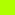

# molokayo

A very tweaked molokai-based theme for **VS Code**. Based on [the vim theme by fmoralesc](https://github.com/fmoralesc/molokayo).

## Languages supported

The following language have been specifically tested against this theme:

Progress:

- [ ] Python
- [ ] HTML
- [ ] Django Templates
- [ ] PL/SQL
- [ ] Vue.js

**NOTE:** Other languages will probably look okay with this theme, but they have not been considered or tested at this time. Support for other languages may be added to this theme at a later date.

## Color Palette

| Name            | Color                                                | 256 Colors | Scope Rules                                                                             |
| --------------- | ---------------------------------------------------- | ---------- | --------------------------------------------------------------------------------------- |
| White           | <kbd></kbd> `#ffffff` | 15         | Variables, Normal function parameters                                                   |
| SpringGreen3    | <kbd></kbd> `#00d75f`            | 41         | Imports, Special Characters and Delimiters                                              |
| SteelBlue1      | <kbd></kbd> `#5fd7ff`            | 81         | Built-in/Global Function calls, Types, Storage type Keywords (def, class, lambda, etc.) |
| MediumPurple1   | <kbd></kbd> `#af87ff`            | 141        | Built-in Constants (`None`, `True`, `False`, etc.)                                      |
| GreenYellow     | <kbd></kbd> `#afff00`            | 154        | Special function calls                                                                  |
| DeepPink2       | <kbd></kbd> `#ff005f`            | 197        | Misc. Keywords (control flow, `return`, etc.), SQL clause keywords                      |
| DarkOrange      | <kbd></kbd> `#ff8700`            | 208        | Special arguments, kwargs, `self`                                                       |
| Orange1         | <kbd></kbd> `#ffaf00`            | 214        | Struct/Object keys, function call kwarg keys                                            |
| LightGoldenrod2 | <kbd></kbd> `#ffd787`            | 222        | Strings, regular expressions                                                            |
| Grey11          | <kbd></kbd> `#1c1c1c`            | 234        | Editor background                                                                       |
| Grey30          | <kbd></kbd> `#4e4e4e`            | 239        | Unused                                                                                  |
| Grey39          | <kbd></kbd> `#626262`            | 241        | Unused                                                                                  |
| Grey50          | <kbd></kbd> `#808080`            | 244        | Delimiters, de-emphasized characters                                                    |
| Grey66          | <kbd></kbd> `#a8a8a8`            | 248        | Comments                                                                                |
